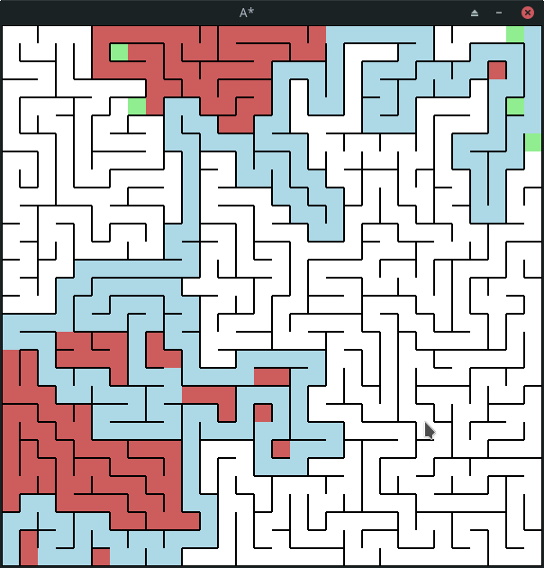

# a-star
A* Search algorithm visualization. The program generates a random grid of nodes and then solves for the shortest path between the bottom left node and the top right node.

## Running
To run the program, run the following command.
```bash
go run *.go
```



## Controls
`r` - Restarts the search
`Space` - Creates a new grid
`Esc` - Exits the program